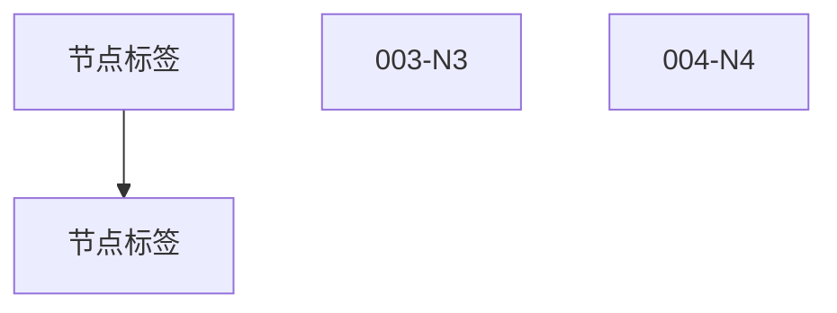
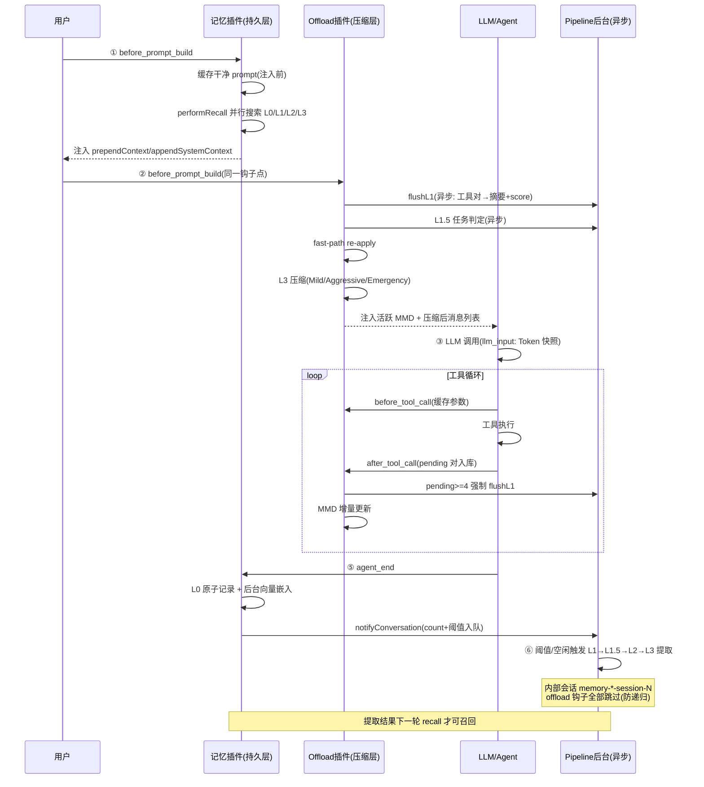
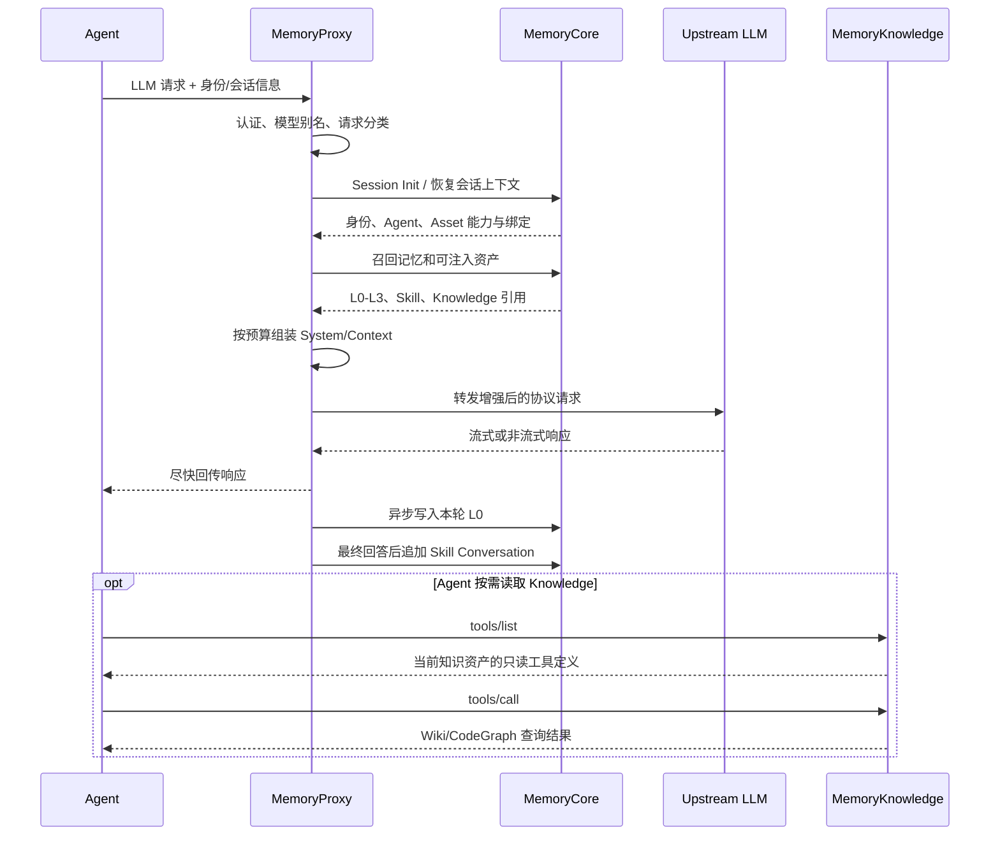
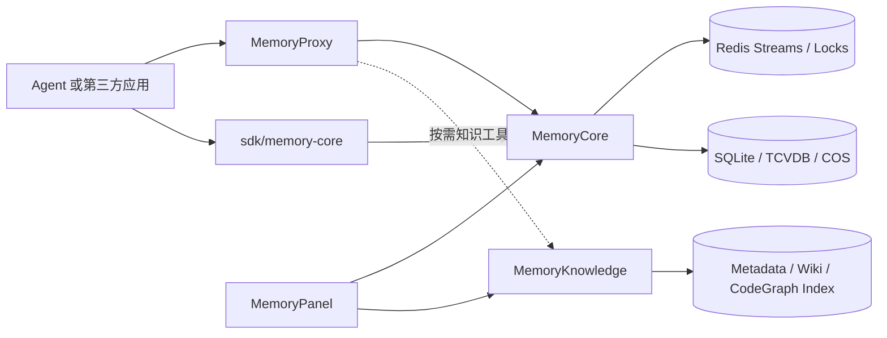

# TencentDB Agent Memory — L0-L3 四层渐进式记忆提取架构深度分析

> - 来源：TencentCloud/TencentDB-Agent-Memory 源码阅读
> - 主篇日期：2026-08-19 ｜ 补篇日期：2026-08-28
> - 覆盖：记忆内核、接入代理、知识服务、控制面与 SDK 的关键实现

## 目录

1. 架构全景：双层 L0-L3 系统
2. L0：原始对话捕获层 — 6 步防反馈循环
3. L1：原子事实提取层 — 双重含义 + score 评分
4. L1.5：任务生命周期判断层 — 未记录的决策门关
5. L2：场景知识构建层 — Mermaid 流程图 + 向下只减定时器
6. L3：长期画像与 Token 压缩层 — 四级渐进式压缩
7. 异步流水线编排：单进程 vs 多副本
8. 多副本部署架构：Redis + 分布式锁 + 无 Leader 选举
9. 整体数据流：捕获 → 压缩 → 召回 → 注入
10. 关键设计决策总结：10 条核心思想
11. 五大组件全景（补篇）
12. v2 网关工程要点（补篇）
13. Offload 运行模式（补篇）
14. 内部会话互斥：防止"压缩递归"（补篇）
15. before-prompt-build 三阶段（补篇）
16. 存储与检索后端（补篇）
17. 补充常量速查（补篇）
18. 系统级分层：接入面、数据面、知识面与控制面（补篇）
19. 一次 Agent 请求如何穿过五大组件（补篇）
20. Memory Asset、Loadout 与 ACL 治理模型（补篇）
21. Knowledge 为什么采用工具化按需读取（补篇）
22. 组件依赖、故障边界与部署拓扑（补篇）

---

## 1. 架构全景：双层 L0-L3 系统

TencentDB Agent Memory 的记忆系统是一个**双层架构**，每一层都有双重含义：

```text
                    ┌─────────────────────────────────────────┐
                    │         持久存储层 (Gateway SQLite)        │
                    │  L0 Conversation → L1 Atom → L2 Scenario → L3 Persona │
                    └─────────────────────────────────────────┘
                                      ↑ 写入 (capture hook)
                    ┌─────────────────────────────────────────┐
                    │       上下文压缩层 (Offload, 运行时)       │
                    │  L1 Offload → L1.5 → L2 Offload → L3 Offload │
                    └─────────────────────────────────────────┘
                                      ↑ 读取 (recall hook)
```

### 1.1 两层含义对照表

| 层级 | 持久存储层（Gateway SQLite） | 上下文压缩层（运行时 Offload） |
| --- | --- | --- |
| L0 | 原始对话写入，经 capture hook 6 步清洗后 POST 到 Gateway | — |
| L1 | 从对话提取的事实/偏好/约束/事件，存储为可搜索的原子记录 | 工具调用结果摘要化，替换原始 tool result 为精简 summary |
| L1.5 | —（未在 README 中记录） | 任务生命周期判断（完成/继续/新任务/延续），MMD 文件管理决策门关 |
| L2 | 以 Mermaid 流程图形式存储的场景知识，按 agent/profile 组织 | MMD 流程图作为场景记忆注入对话上下文，节点 status（done/doing/paused/blocked） |
| L3 | Persona（长期画像），稳定的用户特征/偏好/风格 | 四级渐进式 Token 压缩：Mild → Aggressive → Emergency |

### 1.2 关键认知

- **L0-L3 不是一套系统，而是两套**：持久存储层负责"记住"，上下文压缩层负责"压缩"。两者通过 Pipeline 异步流水线连接。
- **L1.5 是未在 README 中记录的中间层**：位于 L1 和 L2 之间，负责判断当前对话属于哪个任务，是 MMD 文件管理的决策门关。
- **L2 使用 Mermaid 流程图作为场景记忆表示**：不是纯文本，而是拓扑认知状态机 — 极度压缩 Token 且保留任务结构。

---

## 2. L0：原始对话捕获层 — 6 步防反馈循环

### 2.1 职责

L0 是记忆系统的**入口**，负责将 Agent 的每一轮对话（user + assistant + tool 消息）捕获并写入 Gateway。

### 2.2 实现：capture.ts — 6 步捕获流程

```text
agent_end hook 触发
  │
  ├─ 1. 位置切片 (extractLocationSlice)
  │     └─ 从 messages 数组中定位本轮新增的消息范围
  │     └─ 不是全量捕获，只捕获本轮新增的消息
  │
  ├─ 2. 提取用户/助手消息 (extractUserAssistantMessages)
  │     └─ 过滤 tool 消息，只保留 user + assistant
  │
  ├─ 3. 时间戳过滤 (filterMessagesByTimestamp)
  │     └─ 只保留晚于上次捕获时间的消息（防重复）
  │
  ├─ 4. 替换被污染的用户消息 (replaceContaminatedUserMessages)
  │     └─ ⚠️ 关键设计：用缓存的原始文本替换被 prependContext 注入的 L1 记忆
  │     └─ 防止记忆反馈循环（注入的记忆被当作用户输入再次捕获）
  │
  ├─ 5. 清洗过滤 (sanitizeText + stripCodeBlocks + shouldCaptureL0)
  │     └─ 去除特殊字符、代码块标记
  │     └─ 过滤空消息和太短的消息
  │
  └─ 6. POST 到 Gateway
        └─ POST /v3/conversation → 写入 L0 存储
        └─ 同时调用 pipeline.notifyConversation(sessionKey, messages)
```

### 2.3 防反馈循环机制

**问题**：prependContext 会将 L1 记忆注入到用户消息前（`<relevant-memories>` 标签）。如果直接捕获，注入的记忆会被当作"用户输入"再次写入 L0，形成"记忆→捕获→记忆"的死循环。

**解决方案**：

- 在 `before_agent_input` 阶段，缓存原始用户消息文本到 `originalUserMessages` Map
- 在捕获阶段，用缓存的原始文本替换被污染的消息
- 确保只有真正的用户输入被捕获，注入的记忆不被捕获

### 2.4 消息缓冲机制

L0 消息被缓冲在 `MemoryPipelineManager` 的 `messageBuffers` Map 中（按 sessionKey 分组），不立即写入——等待 L1 批量处理。这避免了每条消息都触发一次 L1 提取。

---

## 3. L1：原子事实提取层 — 双重含义 + score 评分

### 3.1 双重含义

| 层面 | 位置 | 功能 |
| --- | --- | --- |
| 持久 L1 | Gateway SQLite | 从对话中提取的事实/偏好/约束/事件，存储为可搜索的原子记录 |
| Offload L1 | 运行时上下文 | 将工具调用结果替换为精简摘要，压缩上下文 Token |

### 3.2 持久 L1：l1-prompt.ts — 工具调用摘要 Prompt

**输入**：一对或多对 `(tool_call, tool_result)` JSON 对象
**输出**：JSON 数组，每个元素包含：

```json
{
  "tool_call": "原始工具调用名",
  "summary": "≤200 字的摘要",
  "tool_call_id": "工具调用 ID",
  "timestamp": "ISO 时间戳",
  "score": 0-10
}
```

关键参数：

| 参数 | 值 | 说明 |
| --- | --- | --- |
| `PARAMS_MAX_LEN` | 500 | 工具参数最大截断长度 |
| `RESULT_MAX_LEN` | 2000 | 工具结果最大截断长度 |
| `COMPRESS_THRESHOLD` | 200 | 超过此字符数才触发压缩 |

**score 字段的打分依据**：score **不是代码计算的客观指标**，而是 L1 摘要 LLM 在生成 summary 时同步给出的**主观评估**，打分指令内嵌于 `L1_SYSTEM_PROMPT`：

> 结合**信息密度**和**任务目的**分析 summary 对于原文的可替代性，范围 0-10，越接近 10 表示 summary 越能替代原文。

评估框架来自 prompt 中的三步内部思考：①任务对齐（这个调用服务于什么任务）→ ②价值过滤（结果中的关键线索/动作/修改/报错）→ ③影响评估（对后续任务推进或阻塞的影响）。特征：无客观 rubric，纯 LLM 判断；LLM 漏打分时 `l1-parser.ts` 缺省取 **5**（中性分）。

**score 的下游消费（Mild 级联）**：高分（8-10）= 摘要可替代原文 = **优先被替换为摘要**（损失小、省 Token）；低分（0-3）= 原文不可替代 = 尽量保留。注意 Mild 是"替换为摘要"而非删除；Aggressive 才是删除且不看 score。

### 3.3 Offload L1：运行时工具结果替换

在 `l3-helpers.ts` 中实现：

- `replaceWithSummary(msg, entry)`：将 tool result 消息替换为 `[Summary of original tool result: ...]` 格式的文本
- `replaceAssistantToolUseWithSummary(msg, entries)`：将 assistant 的 tool_use 块替换为摘要
- `compressNonCurrentToolUseBlocks(msg, ...)`：压缩非当前任务的 tool_use 块

压缩参数：

| 参数 | 值 | 说明 |
| --- | --- | --- |
| `COMPACT_TOOL_CALL_MAX_TOTAL` | 300 | 工具调用总字符数上限 |
| `COMPACT_ARG_TRUNCATE_AT` | 60 | 参数截断长度 |

### 3.4 Pipeline 中的 L1 触发机制

L1 由 `MemoryPipelineManager.notifyConversation()` 触发，有两种路径：

- **阈值触发（Path A）**：当 session 的 `conversation_count >= effectiveThreshold` 时立即触发
  - 默认 `everyNConversations = 5`
  - **Warm-up 模式**：新 session 的阈值从 1 开始指数增长（1→2→4→8→...→5），让早期对话快速处理
- **空闲触发（Path B）**：当 session 空闲 `l1IdleTimeoutSeconds`（默认 60s）后触发
  - 使用 `ManagedTimer` 实现可重置定时器

L1 执行流程：

```text
notifyConversation → 检查阈值 → enqueueL1 → l1Queue.add(runL1)
  │
  ├─ runL1: 取出所有缓冲消息 → 调用 l1Runner(msg, bg_msg)
  ├─ 成功: conversation_count 重置为 0 → advanceWarmup → advanceL2Timer
  ├─ 失败: 消息放回 buffer → 重试 (最多 5 次, 30s 间隔)
  └─ 返回 hasFullBacklog → 立即再次 enqueueL1 (排空积压)
```

---

## 4. L1.5：任务生命周期判断层 — 未记录的决策门关

### 4.1 定位

L1.5 是**未在 README 中记录的中间层**，位于 L1 和 L2 之间，负责判断当前对话属于哪个任务（新任务？延续旧任务？任务已完成？）。

### 4.2 实现：l15-prompt.ts — 三步思考链路

```text
输入: 当前用户消息 + 当前活跃 MMD (如果有)
  │
  ├─ Step 1: 剖析意图 (Analyze Intent)
  │   └─ 从用户消息中提取任务目标、关键实体、约束条件
  │
  ├─ Step 2: 对齐当前 MMD (Align with Current MMD)
  │   └─ 如果存在活跃 MMD，判断新消息是否属于同一任务
  │   └─ 输出: isContinuation (是否延续当前任务)
  │
  └─ Step 3: 检索历史 MMD (Search History MMDs)
      └─ 如果新任务，搜索历史 MMD 文件看是否有相似任务
      └─ 输出: continuationMmdFile (延续哪个历史 MMD)
```

输出 JSON：

```json
{
  "taskCompleted": true,
  "isLongTask": true,
  "isContinuation": true,
  "continuationMmdFile": "xxx.mmd",
  "newTaskLabel": "任务标签"
}
```

### 4.3 在 Pipeline 中的角色

L1.5 是 MMD 文件管理的决策门关：

| 输出字段 | 触发动作 |
| --- | --- |
| `taskCompleted = true` | 关闭当前 MMD 文件，触发 L2 生成最终场景知识 |
| `isContinuation = true` | 继续使用当前 MMD，增量更新 |
| `newTaskLabel` 非空 | 创建新 MMD 文件，开始新任务的场景记录 |
| `continuationMmdFile` 非空 | 加载历史 MMD，恢复旧任务的上下文 |

### 4.4 Offload L1.5 的执行

在 `pipeline-worker.ts` 中，`offload-l15` 任务类型是 **lock-free** 的（不需要分布式锁），因为：

- 多个 L1.5 LLM 调用可以并发执行
- 只在最终写 `state.json` 时加短锁

---

## 5. L2：场景知识构建层 — Mermaid 流程图 + 向下只减定时器

### 5.1 双重含义

| 层面 | 位置 | 功能 |
| --- | --- | --- |
| 持久 L2 | Gateway 文件系统 | 以 Mermaid 流程图形式存储的场景知识，按 agent/profile 组织 |
| Offload L2 | 运行时上下文 | 将 MMD 流程图注入对话上下文，作为认知状态机引导 Agent |

### 5.2 持久 L2：l2-prompt.ts — Mermaid 流程图生成

**输入**：L1 提取的原子事实 + 当前 MMD 文件内容（如果有）
**输出**：Mermaid `flowchart TD` 格式的认知状态机

两种更新模式：

| 模式 | 触发条件 | 操作 |
| --- | --- | --- |
| `replace` | 增量更新，MMD 未满 | 替换指定 node block，保留其他节点 |
| `write` | 全量重写，MMD 接近 4000 字符预算 | 重新生成整个流程图 |

MMD 节点结构：



输出 JSON：

```json
{
  "file_action": "replace",
  "mmd_content": "完整的 Mermaid flowchart 代码",
  "replace_blocks": [{ "node_id": "001-N1", "new_content": "..." }],
  "node_mapping": { "001-N1": "工具调用 ID" }
}
```

### 5.3 L2 触发机制：向下只减定时器（Downward-Only Timer）

```text
L1 完成 → advanceL2Timer(sessionKey)
  │
  ├─ 计算 desiredTime = max(now + delayAfterL1, lastL2 + minInterval)
  ├─ 如果 desiredTime 早于当前定时器 → 提前触发
  ├─ 如果 desiredTime 晚于当前定时器 → 不调整（向下只减）
  │
  └─ L2 完成 → armL2MaxInterval(sessionKey)
      └─ 设置 T = now + maxInterval（无条件，覆盖任何 pending 定时器）
```

参数：

| 参数 | 值 | 说明 |
| --- | --- | --- |
| `delayAfterL1Seconds` | 90s | L1 完成后等待 90 秒再触发 L2（给远程 L1 写入时间） |
| `minIntervalSeconds` | 900s（15 分钟） | L2 最小间隔，防抖保护 |
| `maxIntervalSeconds` | 3600s（1 小时） | L2 最大间隔，保证最终一致性 |
| `sessionActiveWindowHours` | 24h | 超过 24 小时不活跃的 session 停止 L2 轮询 |

**冷会话保护**：当 L2 定时器触发时，检查 session 最后活跃时间。如果超过 `sessionActiveWindowHours`，取消定时器（不触发 L2），等待下次 L1 事件重新激活。

### 5.4 Offload L2：MMD 注入

在 `llm-input-l3.ts` 中，`injectMmdIntoMessages()` 负责将活跃 MMD 注入对话上下文：

- 找到 `findActiveMmdInsertionPoint()` 定位插入点
- 将 MMD 流程图作为 `<current_task_context>` 标签包装的 user 消息插入
- 提供 Agent 当前任务的完整认知状态

---

## 6. L3：长期画像与 Token 压缩层 — 四级渐进式压缩

### 6.1 双重含义

| 层面 | 位置 | 功能 |
| --- | --- | --- |
| 持久 L3 | Gateway 文件系统 | Persona（长期画像），稳定的用户特征/偏好/风格 |
| Offload L3 | 运行时上下文 | 多级 Token 压缩：Mild → Aggressive → Emergency |

### 6.2 持久 L3：触发机制

L3 是**全局单例**（l3Queue 并发=1），在 L2 完成后触发：

- `l3Pending` 标志去重：如果 L3 正在运行，标记 pending，完成后自动重跑
- `l3Running` 标志防止并发

### 6.3 Offload L3：四级 Token 压缩（llm-input-l3.ts）

这是整个系统最复杂的部分，实现了**四级渐进式压缩**：

```text
上下文 Token 使用率
  │
  ├─ < mildRatio (默认 70%)      → 不触发压缩
  ├─ ≥ mildRatio                 → Mild: 分数级联替换 (Score Cascade)
  ├─ ≥ aggressiveRatio (默认 85%) → Aggressive: 前缀删除 (Prefix Deletion)
  └─ ≥ emergencyRatio (默认 95%)  → Emergency: 尾部删除 + 截断
```

#### Mild 压缩：分数级联替换（compressByScoreCascade）

- 扫描前 `mildScanRatio`（默认 50%）的消息
- 找到有 offloadEntry 的 tool result 消息
- 按 score **降序排序**，高分（可替代性强）优先替换为摘要；阈值从高到低逐轮放宽
- 初始阈值 `MILD_CASCADE_INITIAL_SCORE = 7`，最低 `MILD_CASCADE_FLOOR_SCORE = 1`
- 最少保留 `MILD_CASCADE_MIN_COUNT = 10` 条消息
- LLM 未打分时缺省 score = 5（`entry.score ?? 5`）

```text
第 1 轮: 替换 score ≥ 7 的（最可替代）→ 不够？继续
第 2 轮: 替换 score ≥ 6 的 → 不够？继续
...
第 N 轮: 替换 score ≥ 1 的 → 直到 Token 降到 mild 阈值以下
```

#### Aggressive 压缩：前缀删除（aggressiveCompressUntilBelowThreshold）

- 从消息列表头部开始删除整组 `(tool_use + tool_result)` 对
- 保留最后一条用户消息（`AGGRESSIVE_MIN_MESSAGES_TO_KEEP = 2`）
- 删除后注入历史 MMD 上下文（`buildHistoryMmdInjection`）
- 如果删除的 toolCallIds 属于某个历史 MMD，将该 MMD 的摘要注入上下文

#### Emergency 压缩：尾部删除 + 截断（emergencyCompress）

- 当 Token 超过 `emergencyRatio`（默认 95%）或 `_forceEmergencyNext` 为 true
- 从消息列表尾部删除最重的消息组
- 如果尾部删除不够，截断最大的单条消息（`_emergencyTruncateOversized`）
- 目标：将 Token 降到 `emergencyTargetRatio`（默认 85%）

#### 关键实现细节

- **Token 计数**：优先使用 tiktoken（精确 BPE），回退到启发式估算（中文/1.7 + 英文/4）
- **心跳过滤**：过滤 HEARTBEAT.md 相关的工具调用，减少噪音
- **MMD 注入**：删除消息后注入历史 MMD 摘要，保留任务上下文
- **快速路径重应用**：`fastPathReApply` 在每次 llm_input 事件时检查是否有新的 offload 确认，立即应用

---

## 7. 异步流水线编排：单进程 vs 多副本

### 7.1 MemoryPipelineManager（单进程版）

核心数据结构：

```text
MemoryPipelineManager
  ├─ l1Queue: SerialQueue("L1")     // 并发=1，串行执行
  ├─ l2Queue: SerialQueue("L2")     // 并发=1，串行执行
  ├─ l3Queue: SerialQueue("L3")     // 并发=1，串行执行
  ├─ sessionStates: Map<sessionKey, PipelineSessionState>
  ├─ sessionTimers: Map<sessionKey, SessionTimerState>
  ├─ messageBuffers: Map<sessionKey, CapturedMessage[]>
  └─ l2LastRunTime: Map<sessionKey, number>
```

Session 状态：

```ts
interface PipelineSessionState {
  conversation_count: number;          // 累计对话轮数
  last_active_time: number;            // 最后活跃时间
  l2_pending_l1_count: number;         // 待处理的 L1 计数
  warmup_threshold: number;            // 预热阈值 (0=已毕业)
  last_extraction_time: string;        // 上次 L2 提取时间
  last_extraction_updated_time: string; // 上次 L2 游标
  l2_last_extraction_time: string;     // 上次 L2 完成时间
}
```

生命周期管理：

| 方法 | 说明 |
| --- | --- |
| `start(restoredStates)` | 从 checkpoint 恢复状态，重新入队 pending 会话 |
| `notifyConversation(sessionKey, messages)` | L0→L1 入口 |
| `flushSession(sessionKey)` | 单会话 flush（取消定时器 + 立即触发 L1） |
| `destroy()` | 优雅关闭，2 秒超时，持久化当前状态 |
| Session GC | 每 50 次 notifyConversation 触发，驱逐 72 小时不活跃的会话 |

### 7.2 StatefulPipelineManager（多副本版）

**设计目标**：Core 完全无状态化，支持多副本部署。

关键差异：

- 状态存储从进程内 Map 迁移到 `IStateBackend`（Redis/本地）
- `notifyConversation` → `captureAtomic`（原子递增 + 阈值判断 + 入队/设 Timer）
- L1/L2/L3 执行由外部 PipelineWorker 从 TaskQueue 消费
- Timer 过期检测由 TimerScanner 负责

`IStateBackend` 接口：

```ts
interface IStateBackend {
  getSessionState(instanceId, sessionId): Promise<PipelineSessionState>;
  updateSessionState(instanceId, sessionId, patch): Promise<void>;
  captureAtomic(params): Promise<{ triggered: boolean; conversationCount: number }>;
  enqueueTask(task: TaskPayload): Promise<void>;
  consumeTask(workerId, timeout): Promise<TaskPayload | null>;
  acquireLock(key, workerId, ttl): Promise<boolean>;
  renewLock(key, workerId, ttl): Promise<boolean>;
  releaseLock(key, workerId): Promise<void>;
  // ... 更多
}
```

### 7.3 PipelineWorker（任务消费者）

**架构**：Redis Stream + Consumer Group 竞争消费模型

```text
                    ┌─────────────────┐
                    │   Redis Stream  │
                    │  (Task Queue)   │
                    └────────┬────────┘
                             │ XREADGROUP
          ┌──────────────────┼──────────────────┐
          │                  │                  │
  ┌───────▼──────┐  ┌───────▼──────┐  ┌───────▼──────┐
  │  Worker 1    │  │  Worker 2    │  │  Worker N    │
  │  (60 协程)   │  │  (60 协程)   │  │  (60 协程)   │
  └──────────────┘  └──────────────┘  └──────────────┘
```

任务处理流程：

```text
consumeLoop → backend.consumeTask(workerId, timeout)
  │
  ├─ 获取任务 → processTask(task)
  │   ├─ Step 1: 抢分布式锁 (acquireLock)
  │   │   └─ 锁冲突: 指数退避重试 (200ms → 600ms → 1.8s → 5s)
  │   │   └─ 超时: ACK 消息 + 丢弃任务
  │   ├─ Step 2: 启动锁续约 (每 30s 续约, TTL=4min)
  │   │   └─ 续约失败 → lockLost=true → abortController.abort()
  │   ├─ Step 3: 执行任务 (executeTask)
  │   │   └─ 支持 AbortSignal 中断 LLM 调用
  │   ├─ Step 4: ACK 消息
  │   ├─ Step 5: 级联调度 (L1→L2, L2→L3)
  │   └─ Step 6: 释放锁 + 清理
  │
  └─ 失败处理:
      ├─ 重试 < maxRetries (3次): 指数退避 (5s/15s/45s)
      └─ 重试 >= maxRetries: 死信队列 (Dead Letter)
```

**锁粒度设计**：

```text
默认 (lockGranularity="session"):
  L1: pipeline:{instanceId:teamId:agentId}:s:{sessionId}  — session 级
  L2: pipeline:{instanceId:teamId:agentId}                — agent 级
  L3: pipeline:{instanceId:teamId:agentId}                — agent 级

instance 模式 (legacy):
  L1/L2/L3: pipeline:{instanceId}  — 全部 instance 级
```

**级联调度**：

- L1 完成 → `onL1Complete` → `advanceL2TimerAfterL1`（推进 L2 定时器）
- L2 完成 → `enqueueTask(L3)` + `onL2Complete` → `armL2MaxInterval`

### 7.4 TimerScanner（定时器扫描器）

**架构**：Sharded Timer Scanner（Scheme D + Mode 1）

```text
┌─────────────────────────────────────────────┐
│              Redis 16 分片 ZSET              │
│  shard_0:  {instanceId}\x00{sessionId}:L1_idle    │
│  shard_1:  {instanceId}\x00{sessionId}:L2_schedule│
│  ...                                         │
│  shard_15: ...                               │
└─────────────────────────────────────────────┘
         │ ZRANGEBYSCORE + ZREM (Lua 原子)
         │ 所有 Pod 都运行
┌────────┼────────┐
│  Pod 1 │  Pod 2  │  ...  (无 Leader 选举)
└────────┴────────┘
```

- 每 2 秒扫描一次所有 16 个分片
- 每次最多取 1000 个过期定时器
- Lua 原子操作保证不重复消费
- 解析 member 格式 → 构造 TaskPayload → enqueueTask

---

## 8. 多副本部署架构：Redis + 分布式锁 + 无 Leader 选举

### 8.1 两种部署模式

| 模式 | 状态管理 | 适用场景 |
| --- | --- | --- |
| Standalone（MemoryPipelineManager） | 进程内 Map + checkpoint 持久化 | 单进程，开发/测试 |
| Service（StatefulPipelineManager + PipelineWorker） | Redis + IStateBackend | 多副本，生产环境 |

### 8.2 Service 模式架构

```text
┌─────────────┐  ┌─────────────┐  ┌─────────────┐
│  Gateway 1  │  │  Gateway 2  │  │  Gateway N  │
│  (capture)  │  │  (capture)  │  │  (capture)  │
└──────┬──────┘  └──────┬──────┘  └──────┬──────┘
       │ notifyConversation │                │
       ▼                   ▼                ▼
┌─────────────────────────────────────────────────┐
│              Redis (StateBackend)               │
│  - Session State (Hash)                         │
│  - Task Queue (Stream)                          │
│  - Distributed Locks (String)                   │
│  - Timer Shards (16 × ZSET)                     │
└─────────────────────────────────────────────────┘
       │                   │                │
       ▼                   ▼                ▼
┌─────────────┐  ┌─────────────┐  ┌─────────────┐
│  Worker 1   │  │  Worker 2   │  │  Worker N   │
│  (60 协程)  │  │  (60 协程)  │  │  (60 协程)  │
│  - L1 Runner│  │  - L1 Runner│  │  - L1 Runner│
│  - L2 Runner│  │  - L2 Runner│  │  - L2 Runner│
│  - L3 Runner│  │  - L3 Runner│  │  - L3 Runner│
└─────────────┘  └─────────────┘  └─────────────┘
       │                   │                │
       ▼                   ▼                ▼
┌─────────────────────────────────────────────────┐
│  TimerScanner (All Pods, No Leader Election)    │
│  - 每 2s 扫描 16 分片 ZSET                       │
│  - Lua 原子操作 ZRANGEBYSCORE + ZREM            │
│  - 解析 member → 构造 TaskPayload → enqueueTask  │
└─────────────────────────────────────────────────┘
```

### 8.3 关键分布式设计

- **无 Leader 选举**：TimerScanner 所有 Pod 都运行，通过 Lua 原子操作保证不重复消费
- **锁续约机制**：每个任务持有分布式锁，每 30 秒续约（TTL=4 分钟）。续约失败时通过 AbortSignal 中断 LLM 调用
- **死信队列**：重试 3 次后仍失败的任务进入死信队列，不阻塞主队列

---

## 9. 整体数据流：捕获 → 压缩 → 召回 → 注入

### 9.1 完整数据流

```text
用户输入
  │
  ├─ before_prompt_build(记忆插件): 缓存干净 prompt + performRecall 召回注入
  │
  ├─ before_prompt_build(Offload 插件, 同一钩子点): 压缩主入口
  │   ├─ flushL1(异步) + L1.5 任务判定(异步)
  │   ├─ 应用快速路径重应用 (fastPathReApply)
  │   ├─ L3 Token 压缩 (Mild → Aggressive → Emergency)
  │   └─ 注入活跃 MMD (injectMmdIntoMessages)
  │
  ├─ llm_input: Token 快照缓存
  │
  ├─ Agent 执行: 使用压缩后的上下文
  │   ├─ 工具循环: before_tool_call 缓存参数 / after_tool_call 写 pending 对
  │   ├─ 可调用 tdai_search_memory (主动召回)
  │   └─ 可调用 tdai_read_cos (读取完整场景)
  │
  └─ agent_end: 捕获本轮对话
      ├─ 位置切片获取新增消息
      ├─ 替换被污染的用户消息 (防反馈循环)
      ├─ 清洗过滤
      └─ L0 记录 + notifyConversation → 触发 Pipeline(异步)
```

### 9.2 召回流程（recall.ts + format.ts）

```text
recall hook 触发
  │
  ├─ 并行三路请求 (Promise.allSettled 容错)
  │   ├─ L1: searchAtomic (BM25 + 向量 + RRF 混合检索)
  │   ├─ L3: readCore (读取 Persona)
  │   └─ L2: listScenarios (场景索引)
  │
  ├─ 格式化结果
  │   ├─ formatL1Memories(): 生成 <relevant-memories> 动态注入
  │   │   └─ 注入到用户消息前 (prependContext)
  │   └─ formatSystemContext(): 生成 Persona + SceneNav + ToolsGuide 稳定注入
  │       └─ 注入到系统 prompt (appendSystemContext)
  │
  └─ 工具调用限制: 每轮最多 3 次 search
```

**分层注入策略**：

| 注入方式 | 内容 | 位置 | 特点 |
| --- | --- | --- | --- |
| L1 动态注入（prependContext） | 相关记忆 | 用户消息前 | 每次对话都可能不同 |
| L3 + L2 稳定注入（appendSystemContext） | Persona + 场景索引 + 工具指南 | 系统 prompt | 稳定不变 |
| Agent 主动召回 | 记忆搜索 | `tdai_search_memory` 工具 | Agent 可主动搜索记忆 |

### 9.3 两套系统的交互时序：谁先谁后

核心结论：**持久层跨轮延迟生效，压缩层本轮即时生效**。持久层"记住"的内容最早也要到下一轮 `before_prompt_build` 才能被召回；压缩层的替换/注入则发生在本轮每次 LLM 调用之前。两套系统在 `before_prompt_build` 这一个钩子点上交汇——先注入记忆（持久层读），再压缩上下文（压缩层写）。

一轮对话（turn）内的完整钩子时序：

| 阶段 | 钩子 | 归属系统 | 动作 |
| --- | --- | --- | --- |
| ① | `before_prompt_build` | **持久层（读）** | 缓存干净 prompt（注入前）→ `performRecall` 并行搜索 L0/L1/L2/L3 → 返回 `prependContext`/`appendSystemContext` 注入 |
| ② | `before_prompt_build`（同一钩子点） | **压缩层（写）** | `flushL1`（异步发摘要请求）→ L1.5 任务判定（异步）→ fast-path re-apply → L3 Token 压缩（Mild/Aggressive/Emergency）→ 注入活跃 MMD |
| ③ | `llm_input` | 压缩层 | Token 快照缓存（systemPrompt + historyMessages + prompt） |
| ④ | 工具循环 `before_tool_call`/`after_tool_call` | 压缩层 | 缓存工具参数 → 工具结果写 pending 对；pending ≥ `forceTriggerThreshold`（默认 4）强制 `flushL1`；MMD 增量更新 |
| ⑤ | `agent_end` | **持久层（写）** | `performAutoCapture`：L0 原子记录（读游标→写 JSONL→推进游标）+ 向量索引（后台嵌入）→ `notifyConversation`（count+threshold 原子入队） |
| ⑥ | 后台流水线 | 持久层 | Pipeline 按阈值/空闲定时器触发 L1→L1.5→L2→L3 提取，写入 SQLite/向量库 |

两套系统的关键交互点（防冲突机制）：

| 交互点 | 机制 | 目的 |
| --- | --- | --- |
| `before_prompt_build` 双挂 | 记忆插件与 offload 插件挂同一钩子，各管注入/压缩 | 一个钩子点完成"读记忆 + 压上下文" |
| 内部会话互斥 | 持久层提取 LLM 调用使用 `memory-...-session-N` 会话，offload 钩子检测到即跳过 | 防止压缩层处理持久层的提取流量（递归压缩） |
| 防反馈循环 | recall 注入会污染用户消息；capture 用 ① 阶段缓存的干净 prompt 替换 | 防止"注入→捕获→再注入"死循环 |
| 时效性错位 | 持久层结果下一轮才可召回；压缩层摘要本轮即可用 | 持久层慢而全，压缩层快而糙 |

交互时序图：



---

## 10. 关键设计决策总结：10 条核心思想

1. **双层 L0-L3 架构**：持久存储层（Gateway SQLite）和上下文压缩层（Offload）是两套并行的系统，通过 Pipeline 异步连接。不是一套系统的两个视角，而是两个独立系统。
2. **L1.5 作为未记录的决策门关**：L1.5 是 MMD 文件管理的核心决策点，判断任务完成/继续/新任务/延续旧任务。没有它，L2 无法知道何时创建/关闭/切换 MMD 文件。
3. **防反馈循环是捕获层的核心设计**：prependContext 注入的记忆如果被再次捕获，会形成"记忆→捕获→记忆"的死循环。解决方案是缓存原始用户消息文本，在捕获时替换回去。
4. **L2 使用 Mermaid 流程图作为认知状态机**：不是纯文本，而是拓扑结构。节点有 status（done/doing/paused/blocked），极度压缩 Token 且保留任务结构。4000 字符预算。
5. **向下只减定时器（Downward-Only Timer）**：L2 定时器只能提前不能推迟，保证最终一致性（maxInterval）的同时允许快速响应（delayAfterL1）。
6. **四级渐进式 Token 压缩**：Mild（分数级联替换，score 从高到低逐轮放宽阈值）→ Aggressive（前缀删除整组 tool_use+tool_result 对）→ Emergency（尾部删除+截断超大消息）。每级有明确的阈值和参数。
7. **分布式锁设计精妙**：L1 session 级锁（最大并发），L2/L3 agent 级锁（避免共享目录撞写）。锁粒度按 (instance, team, agent) 散开 hash tag 避免热点。锁续约失败通过 AbortSignal 中断 LLM 调用。
8. **TimerScanner 无 Leader 选举**：所有 Pod 都运行，通过 Lua 原子操作（ZRANGEBYSCORE + ZREM）保证不重复消费。16 分片 ZSET，每 2s 扫描。
9. **索引-内容分离**：L2 召回只注入场景索引（路径），不注入完整内容。Agent 需要时通过 tdai_read_cos 工具主动读取。每轮最多 3 次工具调用。
10. **Token 计数双轨制**：优先 tiktoken（精确 BPE，o200k_base 编码），回退启发式估算（中文/1.7 + 英文/4）。使用 WeakMap 缓存消息 Token，`_offloaded` 标志变化时自动失效。

---

## 附录 A：关键常量速查表

| 常量 | 值 | 位置 | 说明 |
| --- | --- | --- | --- |
| `PARAMS_MAX_LEN` | 500 | l1-prompt.ts | L1 工具参数最大截断长度 |
| `RESULT_MAX_LEN` | 2000 | l1-prompt.ts | L1 工具结果最大截断长度 |
| `COMPRESS_THRESHOLD` | 200 | l1-prompt.ts | 超过此字符数才触发 L1 压缩 |
| `MILD_CASCADE_INITIAL_SCORE` | 7 | llm-input-l3.ts | Mild 压缩初始分数阈值 |
| `MILD_CASCADE_FLOOR_SCORE` | 1 | llm-input-l3.ts | Mild 压缩最低分数阈值 |
| `MILD_CASCADE_MIN_COUNT` | 10 | llm-input-l3.ts | Mild 压缩最少保留消息数 |
| `AGGRESSIVE_MIN_MESSAGES_TO_KEEP` | 2 | llm-input-l3.ts | Aggressive 压缩最少保留消息数 |
| `EMERGENCY_MIN_MESSAGES_TO_KEEP` | 2 | llm-input-l3.ts | Emergency 压缩最少保留消息数 |
| `EMERGENCY_TRUNCATE_MAX_CHARS` | 2000 | llm-input-l3.ts | Emergency 截断最大字符数 |
| `COMPACT_TOOL_CALL_MAX_TOTAL` | 300 | l3-helpers.ts | 工具调用总字符数上限 |
| `COMPACT_ARG_TRUNCATE_AT` | 60 | l3-helpers.ts | 参数截断长度 |
| `delayAfterL1Seconds` | 90s | pipeline-manager.ts | L1 完成后等待 L2 的延迟 |
| `minIntervalSeconds` | 900s (15min) | pipeline-manager.ts | L2 最小间隔 |
| `maxIntervalSeconds` | 3600s (1h) | pipeline-manager.ts | L2 最大间隔 |
| `sessionActiveWindowHours` | 24h | pipeline-manager.ts | 冷会话超时窗口 |
| `l1IdleTimeoutSeconds` | 60s | pipeline-manager.ts | L1 空闲超时 |
| `L1_RETRY_DELAY_MS` | 30s | pipeline-manager.ts | L1 重试延迟 |
| `L1_MAX_RETRIES` | 5 | pipeline-manager.ts | L1 最大重试次数 |
| `DESTROY_TIMEOUT_MS` | 2s | pipeline-manager.ts | 优雅关闭超时 |
| lock TTL | 4min | pipeline-worker.ts | 分布式锁 TTL |
| lock renewal | 30s | pipeline-worker.ts | 锁续约间隔 |
| max retries | 3 | pipeline-worker.ts | 最大重试次数 |
| retry backoff | 5s/15s/45s | pipeline-worker.ts | 指数退避重试间隔 |
| timer scan interval | 2s | timer-scanner.ts | 定时器扫描间隔 |
| timer scan batch | 1000 | timer-scanner.ts | 每次扫描最大数量 |
| ZSET shards | 16 | timer-scanner.ts | 定时器分片数 |

> 主篇分析完成时间：2026-08-19（19 个关键文件，约 8000 行代码）

---

# 补篇：工程架构与横切机制（2026-08-20 增补）

> 来源：`MemoryCore/src/config.ts`、`gateway/`、`offload/` 二次源码核实

## 11. 五大组件全景

| 组件 | 职责 |
| --- | --- |
| **MemoryCore** | 记忆数据面与治理元数据核心：L0-L3、Skill、Context Offload、召回、异步提取，以及 Asset/ACL 元数据；支持 standalone 网关和插件形态，但不构建 Wiki/CodeGraph 正文索引 |
| **MemoryKnowledge** | 独立知识内容服务：负责 Wiki/CodeGraph 的导入、构建、同步、索引、查询及 Agent 只读工具执行 |
| **MemoryProxy** | 多协议透明接入面：兼容 OpenAI、Anthropic、Codex、WorkBuddy 等请求，完成认证、会话识别、记忆注入、上游转发、响应观察与异步回流 |
| **MemoryPanel** | 无状态控制面与聚合层：通过 Port/Adapter 编排用户、团队、Agent、资产、绑定、ACL、知识生命周期和构建进度，Web UI 只是其交互入口 |
| **sdk/memory-core** | 显式接入客户端：提供 Python 与 TypeScript API，供第三方 Agent 不经透明代理直接调用 MemoryCore 能力，不持有独立权威数据 |

## 12. v2 网关工程要点（MemoryCore/src/gateway/）

- **请求校验**：Zod v4 safeParse，失败统一 400（errorEnvelope + formatZodError + requestId）
- **路由挂载**：L0-L3 数据面 handler 同时挂载 `/v2/*` 与 `/v3/*`（历史接口双前缀）；`/v3/skill/*` 独立分段打耗时日志
- **异步触发**：service 模式下 `/v2/conversation/add` 写完 L0 后通过 `v2Deps.notifyPipeline` 回调 `StatefulPipelineManager.notifyConversation`，异步触发 L1 提取（写入路径与提取路径解耦）
- **多实例隔离**：Service 模式注入 per-instance resolvers —— `resolveStore`（StorePool 按 instanceId 取 SQLite/TCVDB 连接 + embedding）、`resolveStorage`（COS 适配器）、`resolveSkillCore`（TcvdbSkillStore + COS）
- **配额控制**：QuotaManager 注入网关，做 memory/credit 限额检查
- **实例销毁**：`POST /v2/instance/destroy` 清空该实例全部数据（v1 风格鉴权门控）

## 13. Offload 运行模式（config.ts 自动推导）

| 模式 | 含义 | 触发条件 |
| --- | --- | --- |
| `local` | 本机直接跑 LLM 压缩（默认） | 未配置任何远端 |
| `backend` | 压缩调用走 `offload.backendUrl` 独立后端 | 显式配置 backendUrl |
| `client` | 压缩调用走顶层 `server.url`（网关的 offload_server/ingest-handler） | 配置了 server.url |
| `collect` | 只采集 offload 数据、不执行压缩（用于数据收集/评估） | 显式指定 |

关键配置默认值（OffloadConfig）：

| 配置 | 默认值 | 说明 |
| --- | --- | --- |
| `forceTriggerThreshold` | 4 | L1 工具对累积阈值，达到即强制触发摘要 |
| `l2NullThreshold` | 4 | L2 Mermaid 独立触发：node_id=null 的条目 ≥4 条 |
| `l2TimeoutSeconds` | 300 | L2 独立触发：距上次 L2 超 300 秒 |
| `mildOffloadRatio` | 0.5 | L3 Mild 压缩触发线 |
| `aggressiveCompressRatio` | 0.85 | L3 Aggressive 压缩触发线 |
| `mmdMaxTokenRatio` | 0.2 | MMD 注入最多占上下文预算 20% |
| `defaultContextWindow` | 200000 | 默认上下文窗口 |
| `maxPairsPerBatch` | 20 | L1 单批最大工具对数 |

## 14. 内部会话互斥：防止"压缩递归"

所有 offload 钩子（after-tool-call、before-prompt-build、llm-input-l3）与 offload_server 入口处都有同一行短路：

```ts
if (/memory-.*-session-\d+/.test(sessionKey)) return;
```

**原因**：记忆/压缩管线自身的 LLM 调用（如 L1 摘要器、L2 Mermaid 架构师）也是以会话形式发起的，若不排除，会形成"压缩 LLM 调用 → 又被 offload 压缩"的递归。记忆侧提取用的内部会话 key 均带 `memory-*-session-N` 前缀，offload 侧据此整体跳过。

这回答了"两套管线如何互不干扰"：**持久记忆管跨会话数据，压缩管当前窗口；两者对彼此的内部会话都做了排除。**

## 15. before-prompt-build 三阶段（L3 压缩主入口）

- **Phase 1 — Fast-path 重放（fastPathReApply）**：每次 prompt 构建前，检查是否有新的 offload 确认（上一轮 after-tool-call 产出的摘要），立即应用已确认的替换/删除，不等 Token 守卫
- **Phase 2 — Token 守卫**：按使用率走三档
  - ≥ 0.85（aggressiveCompressRatio）→ **Aggressive**：前缀删除整组 `(tool_use + tool_result)` 对，保留最后 2 条消息（AGGRESSIVE_MIN_MESSAGES_TO_KEEP），删除后注入历史 MMD 摘要（buildHistoryMmdInjection）
  - ≥ 0.5（mildOffloadRatio）→ **Mild**：compressByScoreCascade 分数级联替换（score 阈值 1→7 逐轮提高，最少保留 10 条）
  - 兜底 → **Emergency**：尾部删最重组 + 截断超大单条（≤2000 字符），目标降回 0.85
- **Phase 3 — MMD 注入**：`injectMmdIntoMessages` 将活跃 MMD（认知状态机）以 `<current_task_context>` 包裹的 user 消息插入 `findActiveMmdInsertionPoint()` 定位点，预算受 `mmdMaxTokenRatio=0.2` 约束

## 16. 存储与检索后端

- **`storeBackend = "sqlite" | "tcvdb"`**：SQLite（默认，本地零依赖）或腾讯云向量数据库 TCVDB；15202 API 错误码（collection 已存在）做竞态自愈
- **Embedding 延迟初始化**：provider="none" 时 dimensions=0，跳过 vec0 表创建；等真实 embedding provider 配置后再建表，避免维度错配
- **BM25**：本地 `@tencentdb-agent-memory/tcvdb-text` 编码器，与向量检索并行后 RRF 混合
- **Token 计数**：优先 tiktoken（o200k_base），回退启发式（中文/1.7 + 英文/4），WeakMap 缓存

## 17. 附录 B：补充常量速查

| 常量 | 值 | 位置 | 说明 |
| --- | --- | --- | --- |
| `forceTriggerThreshold` | 4 | config.ts | L1 强制触发工具对数 |
| `l2NullThreshold` | 4 | config.ts | L2 独立触发 null 条目阈值 |
| `l2TimeoutSeconds` | 300 | config.ts | L2 独立触发超时 |
| `mildOffloadRatio` | 0.5 | config.ts | Mild 压缩触发线 |
| `aggressiveCompressRatio` | 0.85 | config.ts | Aggressive 压缩触发线 |
| `mmdMaxTokenRatio` | 0.2 | config.ts | MMD 注入 Token 预算比 |
| `defaultContextWindow` | 200000 | config.ts | 默认上下文窗口 |
| `maxPairsPerBatch` | 20 | config.ts | L1 单批最大工具对数 |
| `INTERNAL_SESSION_RE` | `/memory-.*-session-\d+/` | offload/session-registry.ts 等 | 内部会话互斥正则 |

---

> 补篇完成时间：2026-08-28

---

## 18. 系统级分层：接入面、数据面、知识面与控制面

前文从 L0-L3 解释了“记忆如何演化”，但部署时更重要的问题是：**请求由谁接入、状态由谁保存、知识由谁构建、配置由谁治理**。按运行时职责，系统可划分为四个平面：

| 平面 | 主要组件 | 核心职责 | 不负责的事情 |
| --- | --- | --- | --- |
| 接入面 | **MemoryProxy**、SDK | 兼容多种 Agent/LLM 协议，认证、会话识别、记忆注入、上游转发、响应捕获 | 不作为长期记忆或知识正文的权威存储 |
| 数据面 | **MemoryCore** | L0-L3 记忆、Skill、Offload、召回、异步提取及 Asset/ACL 等元数据 | 不构建 Wiki/CodeGraph 内容索引 |
| 知识面 | **MemoryKnowledge** | Wiki 与 CodeGraph 的导入、构建、同步、查询和只读工具执行 | 不决定用户能绑定哪些资产 |
| 控制面 | **MemoryPanel** | 用户、团队、Agent、资产、绑定、授权及知识任务的统一管理和聚合展示 | 不复制 Core/Knowledge 的核心数据能力 |

`sdk/memory-core` 位于系统边界，允许第三方 Agent 绕过透明代理，以显式 API 方式调用数据面能力。因此 SDK 是**接入方式**，而不是第五套存储系统。

这四个平面的关键点是“所有权分离”：

- MemoryCore 持有记忆与治理元数据的权威状态；
- MemoryKnowledge 持有知识内容、索引和构建状态；
- MemoryPanel 通过 Port/Adapter 调用前两者，只保存少量任务进度等控制面临时状态；
- MemoryProxy 位于热路径，优先保证 LLM 请求可用，记忆增强失败通常降级而不是阻断。

## 19. 一次 Agent 请求如何穿过五大组件

以下时序以 OpenAI Chat Completions 为主线；Anthropic Messages、Codex Responses 和 WorkBuddy 由各自 Handler 做协议归一化，但记忆生命周期基本一致。



实际实现有五个容易忽略的细节：

1. **Session Init 先于 Injection**：Proxy 先解析 user/team/agent/space 和资产能力，再决定注入什么；否则无法做租户隔离与能力门控。
2. **注入失败非致命**：记忆召回或注入异常时回退到原始请求体，避免增强系统故障拖垮主 LLM 链路。
3. **旁路不是缺陷**：System User 直接透传；辅助请求、标题生成、压缩请求和 DSH Headless 请求跳过部分会话副作用，避免把机器内部流量写成用户记忆。
4. **流式响应也会被观察**：Proxy 以 TransformStream 边回传边累计文本、usage 和 tool call；流结束后再执行回流逻辑，不要求先缓存完整响应。
5. **Skill 以 round 而非 HTTP turn 归档**：工具循环中的中间响应不推送，只有无 tool call 的最终回答才把本轮规范化对话发送到 `/v3/skill/conversation/add`。这样“一次真人问答”只累计一次，避免工具循环放大抽取频率。

L0 与 Skill 是两条不同回流：L0 只保留净化后的真实用户问题和最终回复；Skill Conversation 则保留规范化后的 user、assistant、tool_call、tool_result、system 五类消息，供 Core 达到阈值后异步归档。

## 20. Memory Asset、Loadout 与 ACL 治理模型

系统没有把“一个 Agent 能看到什么”写死在 Prompt 中，而是抽象成可治理的 Memory Asset：

| Asset 类型 | 内容所在服务 | 注入/读取方式 |
| --- | --- | --- |
| `chat_memory` | MemoryCore | 会话召回后直接注入上下文 |
| `skill` | MemoryCore | 固定绑定或按能力注入 Skill/工具说明 |
| `llm_wiki` | MemoryKnowledge | 注入资产说明，正文由工具按需查询 |
| `code_graph` | MemoryKnowledge | 注入图谱能力说明，节点和调用链按需查询 |

治理链路可概括为：

```text
用户/团队身份
  → ACL 判断可访问资产
  → Agent Fixed Asset 形成固定 Loadout
  → Session Init 返回本次能力与绑定
  → Proxy 只注入获准且启用的资产
```

其中，**ACL 决定“能否访问”**，**Fixed Binding 决定“是否默认装载”**，**Capability Flag 决定“本次会话是否启用”**。三者分离后，同一 Wiki 可以被团队共享，不同 Agent 可以拥有不同默认工具集，用户还可以关闭 `chat_memory` 或 `skill` 而不删除底层数据。

知识创建时，Panel 负责跨服务编排：先在 Knowledge 服务创建或构建资源，再以相同 `knowledge_id` 在 Core 幂等登记 `meta_asset`；删除时则级联清理 Knowledge 内容、Core 的知识明细、资产绑定与 ACL。这里采用 `asset_id == knowledge_id`，是为了让跨服务关联不再依赖额外映射表。

## 21. Knowledge 为什么采用工具化按需读取

Wiki 和 CodeGraph 通常远大于一次对话的上下文窗口。若把正文、代码节点和调用链全部塞进 Prompt，不仅 Token 成本高，还会稀释当前问题。因此系统采用 **Progressive Exposure（渐进式暴露）**：

```text
Session Init / Injection
  → 仅暴露资产名称、描述和可用能力
  → Agent 调用 /v3/tools/list 获取该资产的只读工具定义
  → Agent 根据当前问题选择工具
  → 通过 /v3/tools/call 按需读取 Wiki 片段或 CodeGraph 结果
  → 查询结果进入当前推理上下文
```

`/v3/tools/list` 负责能力发现，`/v3/tools/call` 负责执行。两者都校验 `x-tdai-service-id`、`knowledge_id` 和工具参数；服务端按 Wiki/CodeGraph 类型选择工具集合，并以白名单阻止写入、删除等管理操作。也就是说，Agent 获得的是**受控的只读查询能力**，知识创建、重建、同步和删除仍由控制面负责。

知识构建与在线查询也相互解耦：

- Wiki 与 CodeGraph 共用 `BuildQueue`，避免两类重任务分别无上限抢占资源；
- 涉及 LLM 的构建步骤再受全局并发限制，防止单个知识任务耗尽模型配额；
- 服务启动时恢复已有索引，并把上次进程中断的构建任务标记为失败，避免长期停留在虚假的 Building 状态；
- Auto-Sync Scheduler 周期性检查 Git 来源，在内容变化后触发 CodeGraph 同步；
- 构建状态的权威来源在 Knowledge 服务，Panel 中的进度仅用于控制面聚合展示。

这种设计把“记忆召回”和“知识检索”分成两种上下文策略：短小且高相关的记忆可以直接注入，体量大且结构化的知识则先暴露能力、再按需读取。

## 22. 组件依赖、故障边界与部署拓扑

从部署关系看，组件并不是环形互相持有状态，而是围绕 Core 与 Knowledge 两个权威服务形成分层调用：



其中实线表示主要控制或数据调用，虚线表示按能力启用的知识工具路径。源码中的静态 import 或 HTTP 调用数量只能用于发现耦合点，不能直接解释为线上流量、部署强依赖或性能占比。

| 故障位置 | 对用户请求的影响 | 恢复或降级策略 |
| --- | --- | --- |
| MemoryProxy 认证、协议解析失败 | 当前请求立即失败 | 返回协议兼容错误，不进入上游 LLM |
| MemoryCore 召回或注入失败 | 通常仍可调用 LLM，但失去本轮记忆增强 | Proxy 使用原始请求继续转发并记录错误 |
| 上游 LLM 失败 | 当前生成失败 | 按上游协议透传状态和错误信息 |
| L0/Skill 异步回流失败 | 当前回答已返回，后续记忆可能缺失 | 记录错误，由后续轮次或运维补偿，不反向阻断响应 |
| Pipeline Worker 执行失败 | L1-L3/Offload 延迟 | Redis Pending、指数退避、死信和幂等写入共同恢复 |
| Worker 执行中丢失分布式锁 | 当前任务停止，避免两个副本继续产生副作用 | 通过 `AbortSignal` 中止；不 ACK、不级联，由其他 Worker 恢复 |
| MemoryKnowledge 构建失败 | 目标知识暂不可查询，记忆主链不必停止 | 任务标记失败，可重试或重建；其他 Ready 资产继续服务 |
| MemoryPanel 不可用 | 管理和配置变更暂停 | Proxy、Core、Knowledge 的既有在线数据路径可继续运行 |

异步 Pipeline 的可靠性可以概括为：**至少一次消费 + 分布式互斥 + 幂等写入**。Redis Stream Consumer Group 负责分发和 Pending 恢复；按 session 或 agent 获取的锁限制并发副作用；锁续约失败后立即中止任务并保留消息；最终依靠稳定业务键 Upsert，使恢复执行不会生成重复 L1/L2/L3 实体。三者必须一起理解，单独的“不 ACK”并不能保证正确性。

典型部署可按规模逐步展开：

1. **本地或单机**：Proxy、Core、Knowledge、Panel 可作为相邻服务运行，Core 使用 SQLite/COS 兼容存储；
2. **生产多副本**：Proxy 横向扩展承接热路径，Core Worker 通过 Redis Stream 与分布式锁协调，数据进入 TCVDB/COS；
3. **知识重负载**：Knowledge 独立扩容构建队列和查询实例，Panel 仍只作为控制面聚合；
4. **嵌入式接入**：第三方 Agent 使用 SDK 直接调用 Core，不部署透明 Proxy，但仍遵守同一身份、会话和 Asset 治理模型。

最终，TencentDB Agent Memory 不是一个“把聊天记录存起来”的单体插件，而是一套把在线增强、长期记忆、结构化知识和治理控制解耦的 Agent 上下文基础设施。
